<p align="center">
  
</p>

<p align="center">
  
</p>

<p align="center">
  <a href="https://linkedin.com/in/kiseratimon">
    
  </a>
  <a href="https://www.strathmore.edu">
    
  </a>
  
</p>

---

## Who Am I❓

I'm an **Industrial Automation Software Engineer, Systems Researcher, and Final-Year Computer Science student** at **Strathmore University, Nairobi**.

My research and engineering interests sit at the heart of **asynchronous distributed architectures and operational systems optimization**. I focus on designing high-throughput data pipelines, real-time caching systems, and mathematical optimization models capable of modernizing industrial processes and supply chains. My goal is to engineer resilient, low-latency infrastructure that transitions legacy environments into data-driven, automated systems.

Beyond pure research, I design, build and scale **practical, production-grade enterprise utilities**, with a few notable projects being: a three-sided AI-augmented shopping & delivery platform for a local supermarket, civic tech tools that make Kenyan constitutional law semantically searchable, data enrichment pipelines for the Kenyan court system, and reconciliation tooling built during a legal tech internship at the **Kenya Revenue Authority**. I've sharpened this work across stints at **Eenovators Ltd** and through an active freelance software programming practice.

I actively engage with upcoming developers, translating low-level programming complexities, algorithmic theory, and system design paradigms into practical tools that solve tangible engineering bottlenecks.

> *"There is nothing quite so useless as doing with great efficiency something that should not be done at all."*

---

## 🔭 What I'm Currently Building

| | Project | Description | Stack |
|:---:|---|---|---|
| 🚚 | **BansiGo** | Three-sided mobile commerce & last-mile delivery system featuring real-time tracking, Apriori recommendation engines, and graph-based route optimization models | FastAPI · PostgreSQL · Redis · Flutter · Kotlin · M-Pesa Daraja · FCM |
| ⚖️ | **The ECK System** | High-performance automation and web scraping platform engineered to ingest, clean, and reconcile multi-source litigation records dynamically | Python · FastAPI · PostgreSQL · Redis · Streamlit |
| ⚙️ | **DiscoveryLaw** | Semantic search & civic education platform over the Constitution of Kenya. Leverages section extraction, custom entity classification, and spatial-temporal timelines. | Python · pgvector · SQLAlchemy 2.0 |

---

## 🛠️ Technical Ecosystem

### Languages
     

### Frameworks & Libraries
     

### Data, AI & ML
   

### Databases & Infrastructure
   

### Tooling
    

---

## 📚 Currently Exploring

```
📡  MIoTy LPWAN · IoT Protocol Design · Solar-Powered Edge Systems (ESP32)
🧠  ML Theory — Bias-Variance Tradeoff · Regularisation · Decision Trees
🔗  Distributed Systems — Hadoop · MapReduce · Gossip Protocols
🏭  Computer Simulation & Queueing Theory (M/M/1)
```

---

## GitHub Stats

<p align="center">
  
  &nbsp;
  
</p>

<p align="center">
  
</p>

<p align="center">
  
</p>

---

## 🐍 Contribution Snake

<p align="center">
  <picture>
    <source media="(prefers-color-scheme: dark)" srcset="https://raw.githubusercontent.com/KiseraTimon/KiseraTimon/output/github-contribution-grid-snake-dark.svg" />
    <source media="(prefers-color-scheme: light)" srcset="https://raw.githubusercontent.com/KiseraTimon/KiseraTimon/output/github-contribution-grid-snake.svg" />
    
  </picture>
</p>

---

## Connect With Me

- 💼 **LinkedIn:** [linkedin.com/in/kiseratimon](https://linkedin.com/in/kiseratimon)
- 📧 **Email:** `timonkisera360@gmail.com`
- 🌍 **Based in:** Nairobi / Migori, Kenya

<p align="center">
  
</p>

## 🤝 Connect With Me

I'm always open to conversations about **e-health**, **AI for social good**, **research collaboration**, or tech in Africa 🌍

<p align="center">
  <a href="https://linkedin.com/in/kiseratimon" target="_blank">
    
  </a>
  <a href="timon.kisera@strathmore.edu">
    
  </a>
</p>

**I'm always open to conversations about **industrial automation**, **distributed systems design**, **civic tech**, or engineering high-throughput infrastructure in Africa 🌍**


<p align="center">
  
</p>

<p align="center">
  
</p>

<p align="center"><i>Architecting low-latency infrastructure · Bridging AI and Industrial Systems · Building Solutions that Matter · Transforming the Next Generation of Engineers 🌍</i></p>

---
